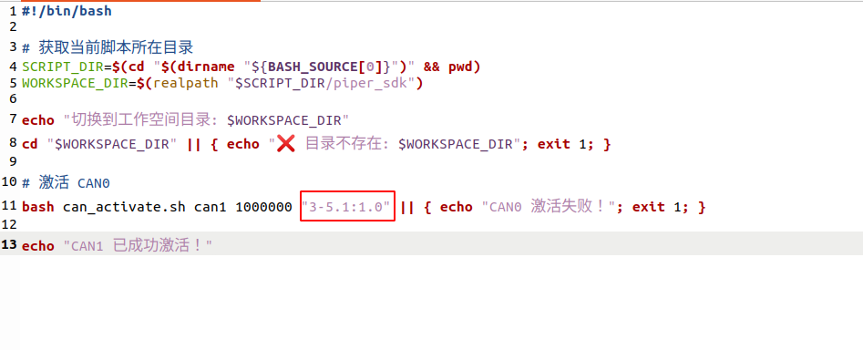
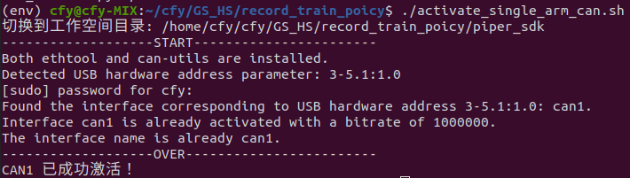
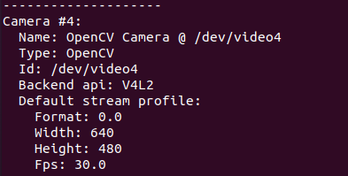
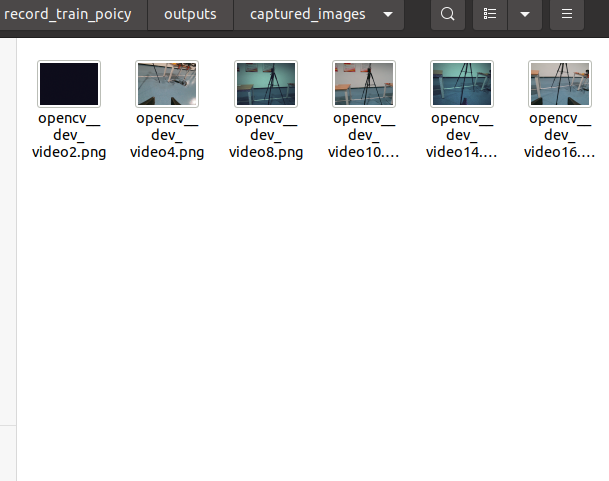

#  Lecture5 VLA
本项目可支持Piper机械臂的数据采集、训练和推理。

> # ⚠️ **Warning**
>
> ## 采集数据阶段请连接主从臂 !
>
> ## 推理阶段请断开主从臂, 只保留从臂 !
>
> ## 在项目的整个过程中，如机械臂出现非正常现象，可尝试拔掉机械臂电源线，切记拔电时应手扶机械臂
---

## ✅ 环境安装

### 创建虚拟环境并安装依赖
```bash
$ conda create -n env python=3.10.9
$ conda activate env
$ pip install -r requirements.txt
```
---

## ✅ 接口配置

#### 1. 启动单臂通信
##### (1) 连接机械臂 usb
> ⚠️ **Note: 第一次连接机械臂前请务必检查 CAN 口配置**

在第一次连接机械臂时，请执行以下步骤查找并配置对应的 **CAN 口**：

*在终端中执行以下命令：

```bash
sudo ethtool -i can0 | grep bus
```
并记录下 bus-info 的数值，例如 3-5.1:1.0; 如果未识别出 can0 , 执行以下脚本查看所有连接的 CAN 模块及其对应的 USB 地址
```bash
$ cd ${项目路径}
$ conda activate env
$ bash piper_sdk/find_all_can_port.sh
```
将 bus-info 的数值填写到{项目路径}/activate_single_arm_can.sh 中, 如下图所示

配置完成后，只要不更换连接的 USB 端口，后续重复连接机械臂时无需再次更改该脚本
##### (2) 激活机械臂 can 口通信
```bash
$ cd ${项目路径}
$ conda activate env
$ ./activate_single_arm_can.sh # 会将机械臂 can 口映射为 can1
```
> ⚠️ **Note**
> 
> 执行完 ./activate_single_arm_can.sh 后会出现如下 can 口激活成功打印，若失败, 重新插拔 usb 或机械臂重新上电, 再尝试连接

#### 2. 查找相机编号
##### (1) 将相机通过 usb 口与主机相连
##### (2) 查找相机编号
```bash
$ cd ${项目路径}
$ PYTHONPATH=. python lerobot/find_cameras.py opencv
```

终端会出现所有识别到的 camera 编号, 如下图所示



同时 record_train_poicy 路径下会出现一个 outputs 文件夹，该文件夹下会产生一个名为 captured_images 的文件夹，存放所有识别到的相机拍摄的单张图，如下图所示



记住所需要使用相机的编号，编号为 video 后的数字 (如 video4, 则该相机对应的编号是4)

腕部相机(wrist)与第三视角相机(top)编号要分别对应相应的index_or_path

## ✅ 采集数据
```bash
$ cd ${项目路径}
# 通过步骤 3 查找到的相机编号，依次修改所需要使用的相机 index_or_path
# dataset.repo_id     : 可根据自己 huggingface 账号命名 (随意命名也可)
# dataset.num_episodes： 记录多少条数据,可根据自己要求进行修改
# dataset.root        : 数据存放地址
# dataset.single_task : 任务名称
# display_data        : 是否在录数据过程中可视化记录数据
$ python -m lerobot.record \
--robot.type=single_piper \
--robot.port=" " \
--robot.id=single_piper_robot \
--robot.cameras="{wrist: {type: opencv, index_or_path: 4, width: 640, height: 480, fps: 30},top: {type: opencv, index_or_path: 10, width: 640, height: 480, fps: 30}}" \
--dataset.repo_id=my_name/single_piper \
--dataset.root=/home/ubuntu/VLA/data \
--dataset.num_episodes=30 \
--dataset.single_task="Grab the cube" \
--display_data=True \
--resume=False
```
> ⚠️ **Note**
> 
> robot.cameras -> index_or_path 使用上一步找到的相机编号
> 
> dataset.root 使用当前电脑的路径  请保持改路径为空（新的） 若该路径不为空 会报错（folder already exist...）
> 
> 如果中途因各种问题导致数据录制提前终止，若想保留原有数据继续录制，需在运行代码中加上"--resume"
> 
> 通过键盘上的方向键（← →）、 esc 键控制记录数据
>
> →   : 当前数据记录结束, 开启下一段数据记录
>
> ←   : 不想保存当前数据, 重新录制该episode（如当前录制episode1，按下 ← 后会重新录制episode1）
>
> esc : 提前终止数据记录, 并保存当前数据


---
## ✅ 训练
```bash
$ cd ${项目路径}
$ conda activate env

### 参数说明
# policy.type          : 策略 (如 act、 diffusion\ smolvla)
# dataset.repo_id      : 可根据自己 huggingface 账号命名 (随意命名也可)
# batch_size           : batch_size 大小
# steps                : 轮次
# output_dir           : 训练权重保存地址
# dataset.root         : 数据集存放地址


### act
$ PYTHONPATH=. python lerobot/scripts/train.py \
--policy.type=act \
--dataset.repo_id=my_name/single_piper \
--batch_size=4 \
--steps=200000 \
--output_dir=/home/ubuntu/VLA/result \
--dataset.root=/home/ubuntu/VLA/data

```
> ⚠️ **Note**
>  
> dataset.root 是执行record脚本时设置的路径
> 
> output_dir 使用当前电脑的路径 (保存模型训练权重的位置)
> 
---


## ✅ 推理部署


### 测试训练权重
```bash
### act
# robot.type           : 机器人类型 (single_piper/dual_piper/moving_dual_piper)
# policy.type          : 策略 (如 act/diffusion/smolvla)
# ckpt_path            : 权重保存地址

$ python -m lerobot.inference \
--robot.type=single_piper \
--robot.id=single_piper_robot \
--robot.cameras="{wrist: {type: opencv, index_or_path: 4, width: 640, height: 480, fps: 30},top: {type: opencv, index_or_path: 10, width: 640, height: 480, fps: 30}}" \
--policy.type=act \
--ckpt_path=/home/ubuntu/VLA/result/checkpoints/200000/pretrained_model \
--task="Grab the cube"

```

> ⚠️ **Warning**
>
> ckpt_path 与上一步output_dir保持一致
>
> 推理时，优先使用最后一个ckpt文件，如200000
>
> 若推理效果不理想，可尝试使用其他轮次权重，如 180000,160000 等，找到推理效果最佳的轮次